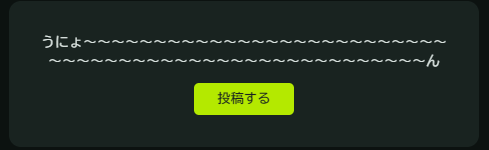

# Misskey-play-games

Misskey Play上で動作可能なAiScriptのコード

AiScript Codes which can run on Misskey Play.

## うにょ～ん / Unyo-n
ランダムな長さの`うにょ～ん`が生成されます。
 / Generates `うにょ～ん` which has random length.

実行例 / Example:

## ゲームおみくじ / Game Omikuji
これで今日遊ぶゲーム選びには困らない！テーブルの中からランダムに選択するおみくじ。プレイヤーが自由にテーブルを編集できます(プレイヤーのローカルデータとして保存できます) / Now you don't have to worry about choosing a game to play today! An *omikuji* (fortune) to be chosen at random from the table. Players can freely edit the table (The table can be saved as local data of the player)

実行例 / Example:

設定画面 / Config page:

おみくじ結果 / fortune result:

